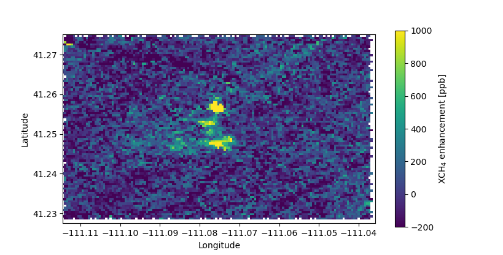

# EMIT greenhouse gas retrieval via RetrievalToolbox

This is a demonstration showing how a greenhouse gas retrieval for EMIT measurements can be implemented with the **RetrievalToolbox** algorithm tools.

The demo is split into two parts:

- An interactive notebook, `Demonstration.ipynb`, which shows a single-scene retrieval that can be run by users at their own pace, step by step. The notebook contains documentation to help users to understand what is all needed to create a CH4/CO2 retrieval from hyperspectral imagers, such as NASA's EMIT.

- A batch processing script, `example.sh`, which launches the retrieval for all scenes within the L1B file.

To run the example(s), some additional data is needed which currently resides on a public Google Drive folder. The files are automatically downloaded when the `setup.sh` script is run. These data include the following

1. Spectroscopy files that were generated with the [ReFRACtor ABSCO toolset](https://github.com/ReFRACtor/ABSCO)
2. The LASP TSIS solar model, which can also be downloaded [here](https://lasp.colorado.edu/lisird/data/tsis1_hsrs_p1nm)
3. An reduced EMIT L1B file, which has been stripped of most valid scenes, apart from a small section which contains a visible CH4 plume. The granule is originally `EMIT_L1B_RAD_001_20230612T162103_2316311_006.nc` and can be downloaded from [NASA's Earthdata catalogue](https://www.earthdata.nasa.gov/data/catalog/lpcloud-emitl1brad-001).

> [!WARNING]
> This is a demonstration only intended to show how **RetrievalToolbox** can be used to implement a gas retrieval for hyperspectral imaging instruments, such as NASA's EMIT. The retrieval algorithm demonstrated here is **not** a fully-tested application. The inferred methane and carbon dioxide concentrations are not accurate, no bias correction or validation against either ground-truths or other retrieval products has been done. For example, the treatment of the surface is far too simplistic to reliably work for spectral windows that are as wide as the ones used in this demo.

## Requirements

The retrieval algorithm and scripts are designed to work on a Unix-like system (Mac OS, Linux) and require only `bash`, a recent version of Python that includes `pip`, and the ability to download and run the `JuliaUp` installer via curl. Administrator privileges are not needed. If you require this example to work on MS Windows, please get in touch via the [issues tracker](https://github.com/RetrievalToolbox/EMIT-retrieval/issues).

## Instructions

- First, clone the repository into a location of your choice with
  - `git clone https://github.com/RetrievalToolbox/EMIT-retrieval.git`
- Navigate into the `EMIT-retrieval` directory and run
  - `./setup.sh`
    - This will download and install the most recent and stable Julia (the language in which EMIT-retrieval is written in) distribution, and then download all packages required to run the examples.
    - Further, a new Python virtual environment is created into which the [`gdown`](https://github.com/wkentaro/gdown) module is installed, which lets us download the required additional files.
- If you **did not** have JuliaUp installed previously, **you must**
  - Re-start your terminal or re-source your shell!
  - Run `./setup.sh` again

> [!IMPORTANT]  
> You **must** re-start or re-source your shell after the first execution of `./setup.sh` to allow for JuliaUp's loaction to propagate into the `$PATH` environment variable, if you did not have JuliaUp installed previously. On Mac OS and most Linux distributions, a simple re-start of the terminal application should work.

The `setup.sh` script can be run multiple times, should e.g. a download fail due to an instable internet connection.

> [!NOTE]
> Should some step in the automated installation fail, and you would like to re-attempt the setup from scratch, you can easily do so. A complete wipe can be done by deleting the cloned directory, as well as removing JuliaUp via `juliaup self uninstall`. If the Julia installation itself failed and seems unrecoverable, you can manually delete the JuliaUp main directory (usually `~/.juliaup`, but can differ).

### Running the interactive notebook

To run the interactive notebook paste following command into a terminal after navigating into the `EMIT-retrieval` directory that was cloned earlier:

`julia +1.11.7 --project=./ -e "using IJulia; IJulia.notebook(dir=pwd())"`

Users might be prompted by `IJulia` to download a version of `JupyterLab` if it is not already installed. Once done, a new browser window will be opened with the classic "notebook" interface. From there simply open up the `Demonstration.ipynb` file and follow the instructions within.

For users who prefer the newer "JupyterLab" interface, run the following instead:

`julia +1.11.7 --project=./ -e "using IJulia; IJulia.jupyterlab(dir=pwd())"`

Should difficulties arise in this step, please refer to [IJulia](https://github.com/JuliaLang/IJulia.jl) or [JupyterLab](https://jupyterlab.readthedocs.io/en/stable/).

The interactive notebook is also uploaded as a pre-rendered HTML file, that can be viewed [here](https://rawcdn.githack.com/RetrievalToolbox/EMIT-retrieval/dcdb02504e9f072b22bd6c3a0c5ce3a48af28109/Demonstration.html).

### Running the batch process

Navigate into the previously cloned `EMIT-retrieval` directory and start the batch processing via

`./example.sh`

This will run batch processing of ~8,000 scenes, and take about 15 minutes to complete in single-process mode (on a 2023 MacBook Pro). The output will then be converted into a compliant GeoTIFF (`demo.tiff`) file that can be viewed with e.g. GIS applications. The retrieval application can utilize additional processes. On most modern machines users can add a number to the command which will then spawn additional processes that also partake in the processing of scenes. For example:

`./example.sh 7`

will cause 7 **additional** processes to be spawned, for a total of 8. In this multi-processing mode, also a progress bar will appear that informs the user of the progress every few seconds.

Note that the batch processing is setup to only retrieve CH4 from a single retrieval window. Once successful, the retrieval should reproduce the methane enhancement due to a plume as shown below. Note that there is no major post-processing in this example, thus surface features will imprint visibly on the XCH4 enhancement fields.

## References

- [NASA EMIT mission](https://earth.jpl.nasa.gov/emit/)
- [EMIT GHG retrieval repository](https://github.com/emit-sds/emit-ghg)
- [ReFRACtor ABSCO toolset](https://github.com/ReFRACtor/ABSCO)
- [RetrievalToolbox.jl](https://github.com/US-GHG-Center/RetrievalToolbox.jl)
- [RetrievalToolbox learning materials](https://retrievaltoolbox.github.io/RetrievalToolbox-Tutorials/)
